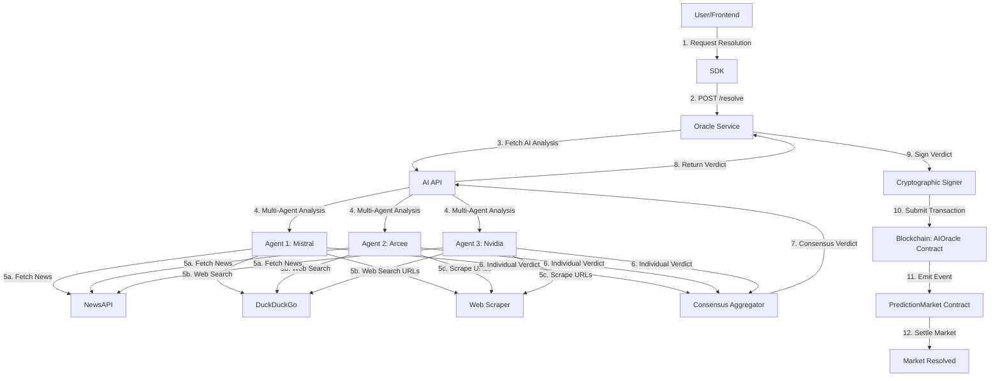
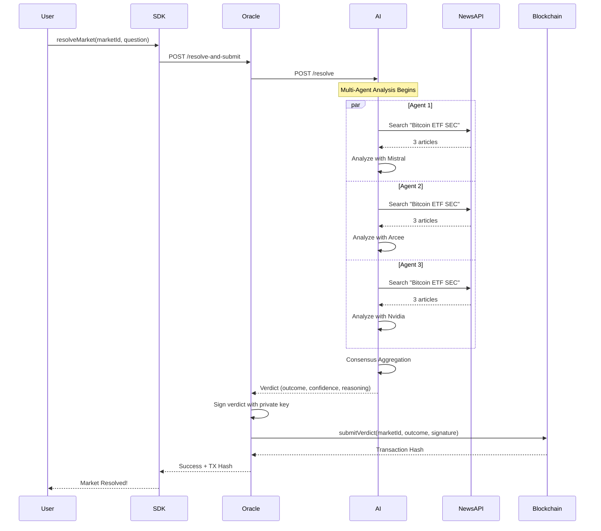

# 🧠 OracleMind

**AI-Powered Decentralized Oracle for Prediction Markets**

OracleMind is a production-ready system that combines multi-agent AI analysis with blockchain oracles to automate the resolution of prediction markets. It fetches real-time data from news APIs, analyzes it using multiple AI agents, reaches consensus, and submits cryptographically signed verdicts on-chain.

[](https://opensource.org/licenses/MIT)
[](https://soliditylang.org/)
[](https://www.python.org/)
[](https://www.typescriptlang.org/)

---

## 🎯 Why OracleMind?

Traditional prediction markets face critical challenges:
- ❌ **Manual Resolution**: Centralized, slow, and prone to bias
- ❌ **Ambiguous Outcomes**: Hard to verify real-world events
- ❌ **Single Point of Failure**: Trust in one resolver

**OracleMind solves this with:**
- ✅ **Multi-Agent AI**: 3 independent AI agents analyze the same question
- ✅ **Real-Time Data**: Fetches news from NewsAPI, DuckDuckGo, and web scraping
- ✅ **Cryptographic Security**: Verdicts are signed and verified on-chain
- ✅ **Fault Tolerance**: System continues even if some agents fail
- ✅ **Optimistic Oracle**: Fast settlement with dispute mechanism

---

## 🏗️ System Architecture



---

## 🔄 End-to-End Flow



---

## 📁 Repository Structure

```
OracleMind/
├── contracts/          # Solidity smart contracts
│   ├── src/
│   │   ├── AIOracle.sol           # Main oracle contract
│   │   ├── DisputeManager.sol     # Dispute resolution
│   │   └── PredictionMarket.sol   # Market logic
│   └── script/Deploy.s.sol        # Deployment script
│
├── ai/                 # Python AI layer
│   ├── agents/
│   │   ├── event_agent.py         # Individual AI agent
│   │   └── aggregator.py          # Consensus logic
│   ├── services/
│   │   ├── api.py                 # FastAPI server
│   │   ├── news.py                # NewsAPI integration
│   │   └── scraper.py             # Web scraping
│   └── requirements.txt
│
├── oracle/             # Node.js oracle service
│   ├── src/
│   │   ├── server.ts              # Express server
│   │   └── submitter.ts           # Blockchain submission (viem)
│   └── package.json
│
├── sdk/                # TypeScript SDK
│   └── src/index.ts               # Developer SDK
│
├── examples/           # Demo scripts
│   └── e2e_demo.ts                # End-to-end demo
│
└── start.sh            # Launch all services
```

---

## 🚀 Quick Start

### Prerequisites
- **Node.js** 18+
- **Python** 3.12+
- **Foundry** (for Solidity)
- **OpenRouter API Key** (free tier)
- **NewsAPI Key** (free tier)

### 1. Clone & Install

```bash
git clone https://github.com/yourusername/OracleMind.git
cd OracleMind

# Install dependencies
cd contracts && forge install && cd ..
cd oracle && npm install && cd ..
cd sdk && npm install && cd ..
cd ai && python -m venv venv && source venv/bin/activate && pip install -r requirements.txt && cd ..
```

### 2. Configure Environment

```bash
# AI Layer
echo "OPENROUTER_API_KEY=your_key_here" > ai/.env
echo "NEWSAPI_KEY=your_key_here" >> ai/.env

# Contracts
echo "RPC_URL=https://rpc.sepolia.mantle.xyz" > contracts/.env
echo "PRIVATE_KEY=0xyour_private_key" >> contracts/.env

# Oracle Service
echo "RPC_URL=https://rpc.sepolia.mantle.xyz" > oracle/.env
echo "PRIVATE_KEY=your_private_key_without_0x" >> oracle/.env
echo "ORACLE_CONTRACT_ADDRESS=0xYourDeployedAddress" >> oracle/.env
```

### 3. Deploy Contracts

```bash
cd contracts
forge script script/Deploy.s.sol --rpc-url $RPC_URL --broadcast
# Copy AIOracle address to oracle/.env
```

### 4. Start Services

```bash
./start.sh
```

This launches:
- **AI API** on `http://localhost:8000`
- **Oracle Service** on `http://localhost:3000`

### 5. Run Demo

```bash
npx tsx examples/e2e_demo.ts
```

---

## 🎮 Usage Examples

### Basic Market Resolution

```typescript
import { OracleMindSDK } from './sdk/src/index';

const sdk = new OracleMindSDK({
    rpcUrl: "https://rpc.sepolia.mantle.xyz",
    oracleAddress: "0xYourContractAddress",
    apiKey: "your-api-key"
});

// Resolve a market
const result = await sdk.resolveMarket(
    "0xmarketId",
    "Did Tesla stock reach $400 in January 2026?"
);

console.log(result.verdict);
// {
//   outcome: false,
//   confidence: 0.85,
//   reasoning: "Based on 3 news sources...",
//   txHash: "0x..."
// }
```

### Custom Questions

The AI can analyze **any yes/no question**:

```typescript
// Sports predictions
"Will Nigeria win against Morocco today?"

// Financial markets
"Did Bitcoin price exceed $100,000 this week?"

// Political events
"Did the US Federal Reserve raise interest rates?"

// Tech announcements
"Did Apple announce a new iPhone model?"
```

---

## 🧪 How It Works

### 1. Multi-Agent AI Analysis

Three independent AI agents analyze the same question:
- **Agent 1**: Mistral (devstral-2512)
- **Agent 2**: Arcee (trinity-mini)
- **Agent 3**: Nvidia (nemotron-nano-9b)

Each agent:
1. Searches **NewsAPI** for relevant articles
2. Uses **DuckDuckGo** for web search
3. **Scrapes** specific URLs for details
4. Analyzes content with LLM
5. Returns verdict with confidence score

### 2. Consensus Mechanism

```python
# Majority vote
yes_votes = 2
no_votes = 1
final_outcome = True  # Majority says YES

# Average confidence from winning side
avg_confidence = (0.85 + 0.90) / 2 = 0.875
```

### 3. Cryptographic Signing

```typescript
// Hash the verdict
const messageHash = keccak256(
    encodePacked(['bytes32', 'bool', 'uint256'], 
    [marketId, outcome, confidence])
);

// Sign with private key
const signature = await wallet.signMessage({ 
    message: { raw: messageHash } 
});

// Submit to blockchain
await contract.submitVerdict(marketId, outcome, confidence, sources, signature);
```

### 4. On-Chain Verification

```solidity
// AIOracle.sol
function submitVerdict(
    bytes32 marketId,
    bool outcome,
    uint256 confidence,
    string[] memory sources,
    bytes memory signature
) external {
    // Verify signature matches authorized signer
    bytes32 messageHash = keccak256(abi.encodePacked(marketId, outcome, confidence));
    address signer = ECDSA.recover(messageHash.toEthSignedMessageHash(), signature);
    require(signer == authorizedSigner, "Invalid signature");
    
    // Store verdict
    verdicts[marketId] = Verdict({
        outcome: outcome,
        confidence: confidence,
        timestamp: block.timestamp,
        sources: sources
    });
    
    emit VerdictSubmitted(marketId, outcome, confidence);
}
```

---

## 🔒 Security Features

- **Cryptographic Signatures**: All verdicts are ECDSA-signed
- **On-Chain Verification**: Smart contract verifies signer identity
- **Multi-Agent Consensus**: Reduces single-point-of-failure risk
- **Fault Tolerance**: System continues with partial agent failures
- **Dispute Mechanism**: Users can challenge incorrect verdicts
- **Rate Limiting**: Prevents spam and abuse

---

## 📊 Deployed Contracts (Mantle Sepolia)

| Contract | Address | Explorer |
|----------|---------|----------|
| **AIOracle** | `0xd59b94c4489839ffd3396d4df5e382ea1afe28ef` | [View](https://explorer.sepolia.mantle.xyz/address/0xd59b94c4489839ffd3396d4df5e382ea1afe28ef) |
| **DisputeManager** | `0x16a2d20d54e0e826c1dfbb7b1d8325fe0841f62f` | [View](https://explorer.sepolia.mantle.xyz/address/0x16a2d20d54e0e826c1dfbb7b1d8325fe0841f62f) |
| **PredictionMarket** | `0x62fca1b87606b8c30e7198d6e9bcb214833a8ea0` | [View](https://explorer.sepolia.mantle.xyz/address/0x62fca1b87606b8c30e7198d6e9bcb214833a8ea0) |

---

## 🛠️ Technology Stack

### Smart Contracts
- **Solidity** 0.8.20
- **Foundry** (Forge, Cast)
- **OpenZeppelin** Contracts
- **Mantle Sepolia** Testnet

### AI Layer
- **Python** 3.12
- **LangChain** & **LangGraph**
- **OpenRouter** (LLM API)
- **NewsAPI** (News aggregation)
- **DuckDuckGo** Search
- **FastAPI** (REST API)

### Oracle Service
- **Node.js** 18+
- **TypeScript** 5.0
- **Viem** (Ethereum library)
- **Express** (HTTP server)

### Frontend SDK
- **TypeScript**
- **Fetch API**

---

## 🧩 Design Principles

1. **AI Stays Off-Chain**: AI outputs are treated as inputs, not truth
2. **Structured Over Subjective**: Machine-readable verdicts with confidence scores
3. **Optimistic by Default**: Assume correctness, allow disputes
4. **Fault Tolerant**: Graceful degradation when agents fail
5. **Developer-First**: Integration takes minutes, not weeks

---

## 📈 Roadmap

- [x] Multi-agent AI consensus
- [x] NewsAPI integration
- [x] Cryptographic signing
- [x] On-chain verification
- [x] Viem integration
- [ ] Dispute resolution UI
- [ ] Multi-chain deployment
- [ ] Governance token
- [ ] Decentralized court system
- [ ] Frontend dashboard

---

## 🤝 Contributing

Contributions are welcome! Please:
1. Fork the repository
2. Create a feature branch
3. Make your changes
4. Submit a pull request

---

## 📄 License

MIT License - see [LICENSE](LICENSE) for details

---

## ⚠️ Disclaimer

**This is experimental software.** Do not use in production or with real funds. The AI verdicts are probabilistic and may be incorrect. Always verify critical decisions independently.

---

## 🙏 Acknowledgments

Inspired by:
- **UMA Protocol** (Optimistic Oracles)
- **Chainlink** (Oracle Networks)
- **Polymarket** (Prediction Markets)
- **LangChain** (AI Agent Frameworks)

---

## 📞 Contact

- **GitHub**: [@yourusername](https://github.com/yourusername)
- **Twitter**: [@yourhandle](https://twitter.com/yourhandle)
- **Email**: your.email@example.com

---

**Built with ❤️ for the future of decentralized prediction markets**
